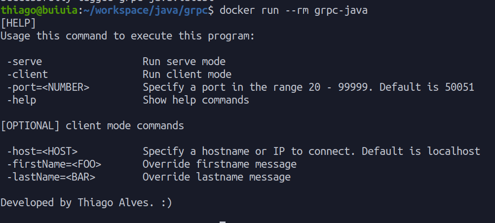

# Estudos - Comunicação gRPC

---
## Porque utilizar gRPC

O gRPC é uma tecnologia de código aberto e alto de desempenho criado pela Google em 2015 com o objetivo de trafegar o mínimo possível de dados na rede. 
Suas principais características que a tornam tão poderosa é a capacidade de comunicação entre diversos sistemas através da rede utilizando o HTTP/2 e protocol buffers.

### Os principais benefícios do gRPC são:

- Estrutura RPC leve e de alto desempenho.
- Desenvolvimento de API Contract-first, usando Protocol Buffers por padrão.
- Tem suporte a várias linguagens de programação.
- Opera de forma síncrona e assíncrona.
- Suporta chamadas streaming client, streaming server e streaming bidirecionais.
- Redução do uso de rede através da serialização do Protobuf.
- Pode ser até 6 vezes mais rápido se comparado com JSON
- Muito recomenado para ambientes com arquitetura em microsserviços
- Recomendado para serviços real-time de ponta a ponta.

---

## Como rodar este projeto



## Utilizando Docker

## Requisitos

- Docker

Execute este comandos no terminal:
```bash
docker build -t grpc-java .
docker run --rm --name serve -p 8080:50051 grpc-java -serve
docker run --rm --name client grpc-java -client -host=<IP-LOCAL> -port=8080
```

Você pode querer criar um link entre os containers para se comunicarem sem necessáriamente expor a porta, exemplo:
```bash
docker network create grpc
docker run --rm --network=grpc --name=serve grpc-java -serve -port=50080
docker run --rm --network=grpc --name=client grpc-java -client -host=serve -port=50080 -firstName=docker -lastName=test
```

### Adicional
Por padrão, o servidor executa na porta `50051` como especificado em exemplos da página oficial do gRPC. 
Mais informações sobre como utilizar a aplicação, digite `-help`

## Buildando manualmente

## Requisitos

- JDK 11+
- Maven 3.6
- IDE de sua preferência

## Passo 1
Antes de executar o projeto, é preciso gerar as classes usadas para implementar e consumir serviços gRPC.  
Em um terminal execute:
```bash
mvn clean package
```

## Passo 2
Executar no modo servidor

```bash
java -jar ./target/grpc-java-jar-with-dependencies.jar -serve
```

## Passo 3
Executar no modo client

```bash
java -jar ./target/grpc-java-jar-with-dependencies.jar -client
```


## Links importantes
- Página oficial gRPC: [clique aqui](https://grpc.io/)
- Design Principles: [clique aqui](https://grpc.io/blog/principles/)
- Compilando código gRPC baseando em java: [Clique aqui](https://github.com/grpc/grpc-java)
